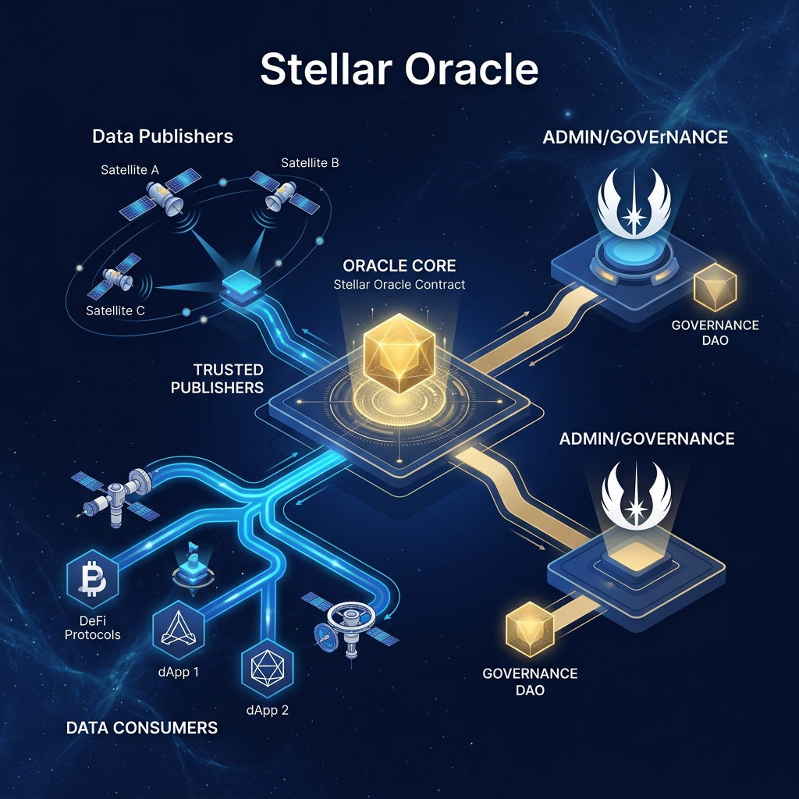
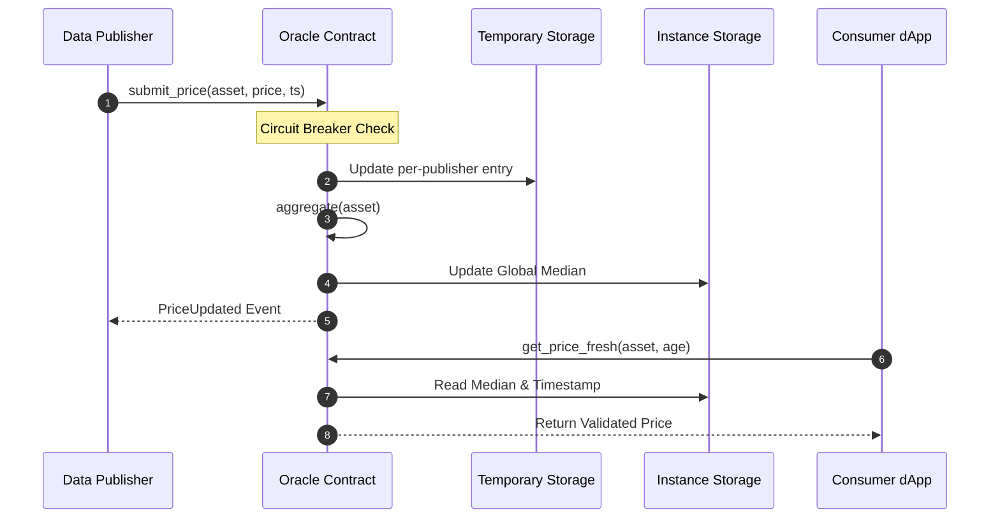

<p align="center">
  
</p>

# Stellar Oracle: The Data Backbone of Soroban DeFi

[](https://lab.stellar.org/r/testnet/contract/CA76KLJ2CDD5OHVGD6MUV3QVZYRNJJQLIHBMWD353J6ES4JZXCO4L5OQ)
[](https://drips.network/wave/stellar)
[](LICENSE)
[](https://soroban.stellar.org)

**Stellar Oracle** is an open-source, decentralized price feed network designed specifically for the Soroban smart contract platform. We provide the high-fidelity, outlier-resistant data required to power the next generation of DeFi, RWAs, and decentralized insurance on Stellar.

> [!IMPORTANT]
> **Contributors Wanted!** We are actively seeking developers to help build out the monitoring dashboard, TWAP aggregation, and publisher reputation systems. Earn rewards via the [Stellar Wave Program](https://drips.network/wave/stellar).

---

## 🛰️ Ecosystem Overview

The Stellar Oracle connects high-frequency data publishers with mission-critical dApps through a secure, median-aggregated on-chain engine.

<p align="center">
  
</p>

---

## 🛠️ Core Technology

We leverage the cutting-edge features of **Soroban** to provide a reliable and gas-efficient oracle solution:

- **🛡️ Median-Aggregation Engine**: Our Rust-based contract automatically computes the median of all active publisher feeds, making the price immune to outliers and single-source manipulation.
- **⚡ Hybrid Storage Strategy**: 
  - **Instance Storage**: Stores global feed state and publisher whitelists for high-speed access.
  - **Temporary Storage**: Stores granular, per-publisher price entries. This drastically reduces "state bloat" and keeps the contract footprint lean.
- **🚨 On-Chain Circuit Breaker**: Admin-configurable `max_deviation_bps` rejects any submission that deviates too far from the current median—protecting consumers from flash-crash anomalies.

---

## 💰 Earn & Contribute

This project is part of the **Stellar Wave Program**. By contributing, you not only help secure the Stellar ecosystem but can also earn rewards for your merged pull requests.

### 🌟 Wanted: Good First Issues
New to Soroban? These issues are perfect for getting your feet wet:
| Issue | Description | Difficulty |
| :--- | :--- | :--- |
| [#41](ISSUES.md#L632) | Add `get_publisher_count()` view function | Easy |
| [#13](ISSUES.md#L202) | Add Dockerfile for the publisher bot | Medium |
| [#25](ISSUES.md#L380) | Complete the `read-prices` example script | Easy |
| [#51](ISSUES.md#L780) | Integrate Rust Clippy & Fmt into CI | Easy |

### 🚀 Advanced Bounties
Ready for a challenge? Help us build the future of the oracle:
- **TWAP Aggregation ([#2](ISSUES.md#L23))**: Implement time-weighted average price history.
- **Publisher Reputation ([#3](ISSUES.md#L40))**: Build an on-chain scoring system for data providers.
- **React Dashboard ([#5](ISSUES.md#L72))**: Create a real-time monitoring interface with Tailwind.

---

## 🏗️ Technical Architecture

### Data Flow Sequence


---

## 🚀 Quick Start for Developers

### 1. Environment Setup
```bash
# Add the Wasm target
rustup target add wasm32-unknown-unknown

# Install Stellar CLI
cargo install --locked stellar-cli --all-features
```

### 2. Build & Test
```bash
# Build the optimized Wasm
cargo build --release --target wasm32v1-none

# Run the comprehensive test suite
cargo test
```

### 3. Deploy to Testnet (Sandbox)
```bash
# Deploy and capture ID
export ORACLE_ID=$(stellar contract deploy --wasm target/wasm32v1-none/release/oracle_core.wasm --network testnet --source my-account)

# Initialize
stellar contract invoke --id $ORACLE_ID --network testnet --source my-account -- initialize --admin my-account
```

---

## 💻 Integration Snippets

### TypeScript (SDK)
```typescript
import { OracleConsumer } from "@stellar-oracle/sdk";

const consumer = new OracleConsumer({
  contractId: "CA76...L5OQ",
  rpcUrl: "https://soroban-testnet.stellar.org",
  networkPassphrase: "Test SDF Network ; September 2015",
});

// Fetch a fresh price (throws if older than 5 mins)
const feed = await consumer.getPriceFresh("XLM/USD", 300);
console.log(`Price: ${Number(feed.price) / 1e7} USD`);
```

### Rust (Cross-Contract)
```rust
use soroban_sdk::{contractimport, Address, Env, String};
contractimport!(file = "../../target/wasm32v1-none/release/oracle_core.wasm");

pub fn swap_assets(env: Env, oracle: Address) {
    let client = Client::new(&env, &oracle);
    let price = client.get_price_fresh(&String::from_str(&env, "BTC/USD"), &600).price;
    // ... execute swap logic with 1e7 scaled price
}
```

---

## 📈 Roadmap

- [x] **v0.1**: Core Median Aggregation & Hybrid Storage
- [x] **v0.2**: TypeScript SDK & Publisher Bot
- [/] **v0.3**: TWAP Aggregation & History (In Progress)
- [ ] **v0.4**: Decentralized Publisher Reputation Scoring
- [ ] **v0.5**: Community-led Governance & DAO Integration

---

## 🤝 Community & Support

- **Discord**: [Join our developer channel](https://discord.gg/stellar)
- **Discussions**: [GitHub Discussions](../../discussions)
- **Issues**: [Report bugs or suggest features](../../issues)

---

## 📄 License

This project is licensed under the MIT License - see the [LICENSE](LICENSE) file for details.
Built with ❤️ for the Stellar Community.
