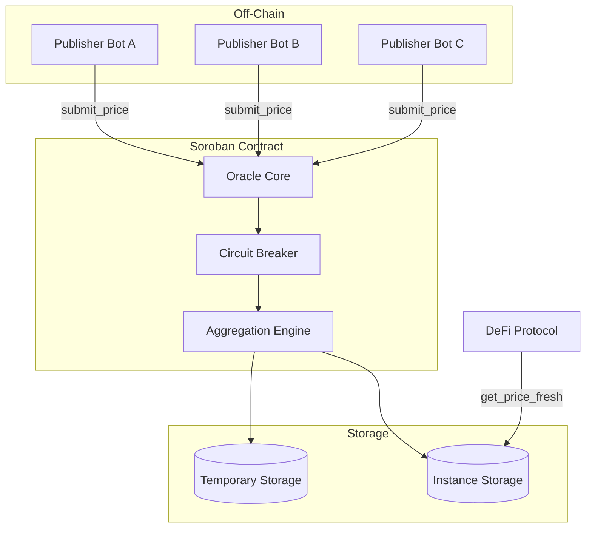

# Stellar Oracle: System Architecture

This document provides a deep dive into the technical design, storage patterns, and security model of the **Stellar Oracle**.

---

## 🏗️ System Overview

Stellar Oracle follows a **push-based multi-publisher model**. Unlike pull-based oracles that fetch data on-demand (often incurring high latency), Stellar Oracle allows authorized publishers to push data on-chain, which is then aggregated into a canonical "Source of Truth" available for immediate, low-latency consumption by other smart contracts.



---

## 🛡️ Trust & Security Model

### Decentralized Publishers
The Oracle does not rely on a single data source. The Administrator whitelists a set of **Trusted Publishers**. Each submission requires cryptographic proof of identity via Soroban's `require_auth()` mechanism.

### Median Aggregation
On every valid submission, the contract triggers a re-aggregation of all known data points for that asset. 
- The contract fetches every active publisher's most recent entry from temporary storage.
- It sorts the values and selects the **Median**.
- **Resilience**: A malicious publisher cannot move the median alone. An attacker would need to compromise **>50%** of the registered publishers to manipulate the aggregated price.

### On-Chain Circuit Breaker
The contract implements a protection layer called the **Deviation Limit**.
- **Configuration**: Admin sets `max_deviation_bps` (basis points).
- **Enforcement**: If a new price deviates from the *current* median by more than the threshold (e.g., 5%), the submission is rejected.
- **Purpose**: This prevents flash-loan attacks or exchange glitches from poisoning the oracle's state before administrators or automated bots can react.

---

## 💾 Storage Strategy

Stellar Oracle is optimized for the Soroban storage fee model:

| Layer | Type | Key | Purpose |
| :--- | :--- | :--- | :--- |
| **Global State** | Instance | `ADMIN`, `PUBS`, `MAXDEV` | Core configuration and whitelists. |
| **Aggregated Feeds** | Instance | `FEEDS` | The latest canonical price for each asset. |
| **Publisher Entries** | Temporary | `(asset, publisher)` | Individual "votes" from publishers. TTL is ~7 days. |

By using **Temporary Storage** for individual submissions, the oracle maintains a small footprint. If a publisher stops reporting, their data automatically "drops out" of the aggregation once the TTL expires, ensuring the oracle doesn't get stuck on stale data from dead nodes.

---

## 📅 Precision & Scaling

To avoid floating-point inaccuracies and ensure deterministic behavior across the network, all prices are handled as **i128** integers scaled by **1e7**.

- **Internal representation**: `price_integer = actual_price * 10,000,000`
- **Example**: A BTC price of `$64,120.50` is stored as `641,205,000,000`.

---

## 🚀 Integration Patterns

### Cross-Contract Consumption (Rust)
Contracts should use `get_price_fresh` to ensure they are not acting on "zombie" data during network congestion or publisher downtime.

```rust
let feed = oracle_client.get_price_fresh(&asset_string, &max_age_secs);
```

### SDK Consumption (TypeScript)
The `OracleConsumer` provides a high-level wrapper around the Stellar SDK to simulate contract calls, allowing for zero-fee price reads in frontends and backend services.
